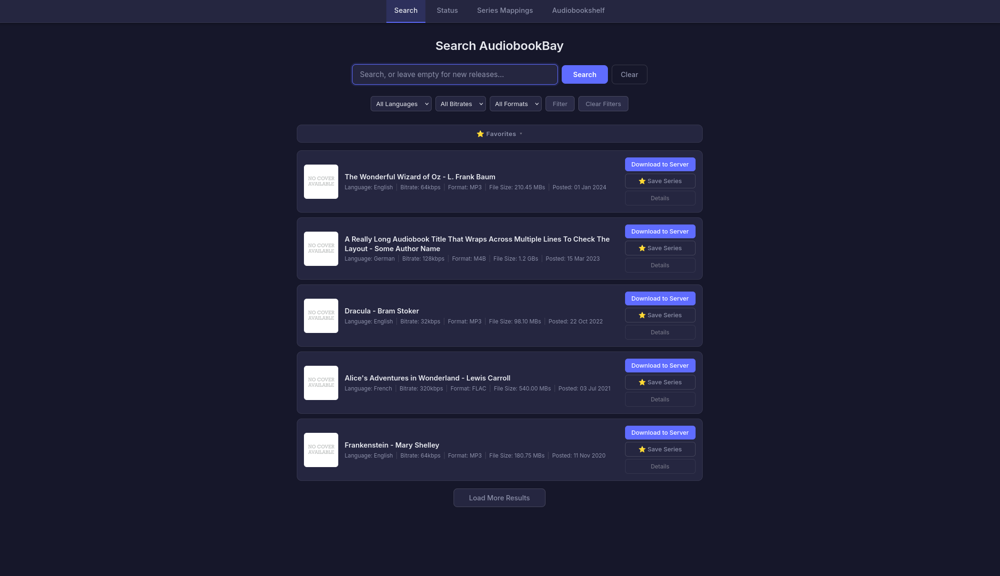
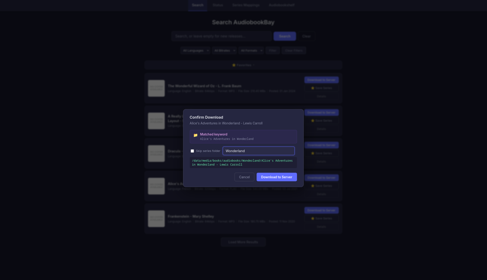
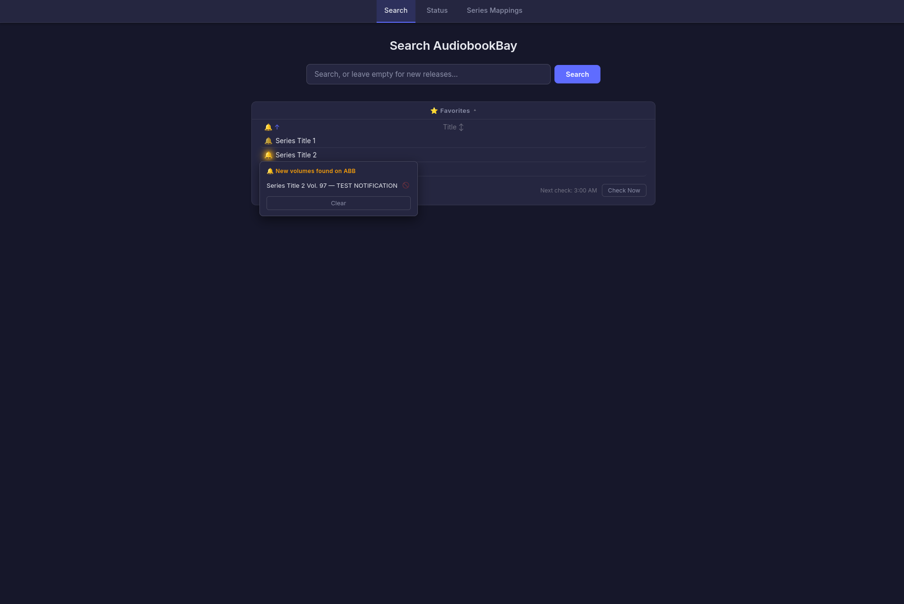
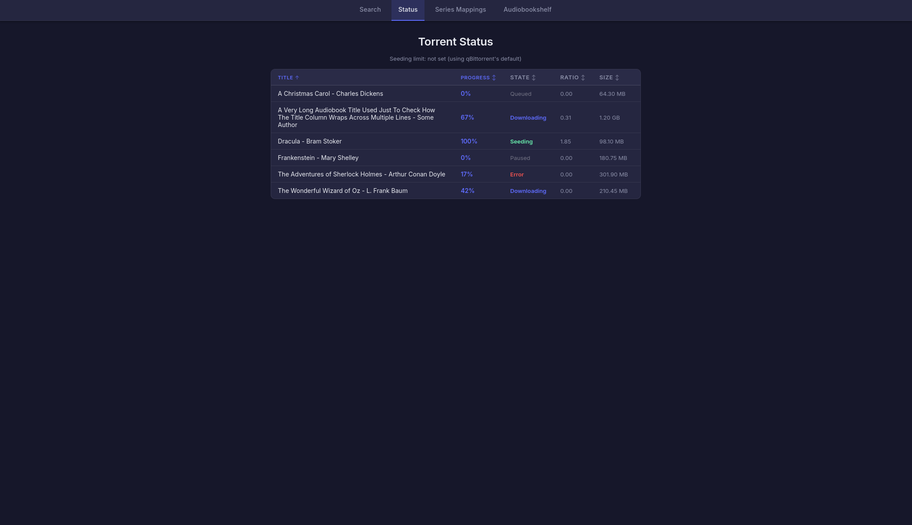
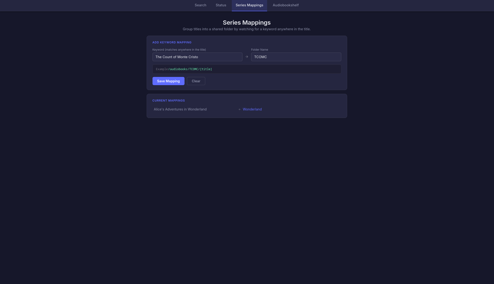

# AudioBookBay Automated
 
A self-hosted web app that searches AudioBookBay, sends results straight to your torrent client, and keeps your audiobook library organized by series automatically. Built for use alongside Audiobookshelf.
 
## Table of Contents
 
- [Overview](#overview)
- [Features](#features)
- [Requirements](#requirements)
- [Setup](#setup)
  - [Volume Mapping](#volume-mapping)
  - [Docker Compose](#docker-compose)
  - [First Run](#first-run)
- [Environment Variables](#environment-variables)
- [Usage](#usage)
- [Notes](#notes)
- [Acknowledgments](#acknowledgments)
## Overview
 
AudioBookBay Automated lets you search AudioBookBay from a clean web interface, preview results with cover art and details, and send a download directly to qBittorrent, Transmission, or Deluge. Completed downloads land in a series-organized folder structure that Audiobookshelf (or any similar library manager) can pick up automatically.
 
Beyond search and download, the app tracks your favorite series, watches for new volumes as they're posted to AudioBookBay, and notifies you in the UI when one shows up that you don't already have on disk.
 
This project began as a fork of the original audiobookbay-automated and has since diverged significantly with its own feature set, UI, and alerting system.
 
## Features
 
**Search and download**
- Search AudioBookBay with cover art, language, format, bitrate, and file size shown per result
- One-click download to your configured torrent client
- Download status page with sortable columns (title, progress, state, ratio, size) so you can check on what's downloading or seeding at a glance
**Library organization**
- Two-level folder structure (Series Name / Book Title) so every volume of a series lands in the same parent folder
- Optional "skip series folder" mode for standalone titles
- Understands the many different ways AudioBookBay titles are formatted — numbered volumes, Roman numerals, volume ranges like "Books 1-12", extra tags like "[Updated]", and more — so series are grouped correctly without any manual setup in most cases, even if a folder already on disk doesn't match AudioBookBay's title exactly
- Keyword folder grouping for franchises where individual book titles don't share a common series name — set a keyword once (e.g. "Star Wars") and every matching AudioBookBay title is grouped into that folder automatically going forward
**Favorites and new volume alerts**
- Favorites panel for series you want to track, with sorting and quick re-search
- Per-series alert bell showing monitoring status and lighting up when a new volume is found
- Daily background check cycle (scheduled, staggered per series to avoid hitting AudioBookBay all at once)
- Manual "Check Now" option to trigger a check outside the daily schedule
- New volumes are compared against what's already on disk, so you're only notified about volumes you don't have
- Dismiss individual notifications or block specific listings permanently so they don't resurface
**Multi-client support**
- Works with qBittorrent, Transmission, or Deluge (Web UI)
## Requirements
 
- Docker
- qBittorrent, Transmission, or Deluge with its Web UI enabled and reachable from the container
- A library manager such as Audiobookshelf (optional, but this app is designed to feed into one)
## Setup
 
### Volume Mapping
 
| Container Path | Purpose | Required | Notes |
|---|---|---|---|
| `/config` | Stores favorites, keyword mappings, alerts, blocklist, the app's `.env`, and the log file | Yes | Must be read/write. Map this to a persistent location on your host. |
| Your audiobook library (any path, set via `SCAN_PATH_BASE`) | Lets the app check which volumes you already have, for fuzzy folder matching, "already exists" warnings, and new volume alerts | Recommended | Should be mounted **read-only**. The app never writes to this path. |
 
`SAVE_PATH_BASE` is not a path the app itself needs mounted. It's the path your torrent client uses to save files, from the torrent client's own perspective. Make sure it matches a path your torrent client can actually write to, and that the torrent client's save location lines up with where your library manager scans from.
 
### Docker Compose
 
```yaml
services:
  abb-automated:
    image: ghcr.io/cheekybeanz/audiobookbay-automated:latest
    container_name: abb-automated
    ports:
      - "5078:5078"
    volumes:
      - /path/to/appdata/abb-automated:/config
      - /path/to/your/audiobooks:/audiobooks:ro
    environment:
      - DOWNLOAD_CLIENT=qbittorrent
      - DL_HOST=qbittorrent
      - DL_PORT=8080
      - DL_USERNAME=admin
      - DL_PASSWORD=changeme
      - DL_CATEGORY=Audiobookbay-Audiobooks
      - SAVE_PATH_BASE=/data/media/books/audiobooks
      - SCAN_PATH_BASE=/audiobooks
    restart: unless-stopped
```
 
### First Run
 
On first launch, the app generates a fully documented `.env` file at `/config/.env` with every available setting explained inline and commented out at its default value. This is the easiest place to configure the app after the first boot.
 
Once `/config/.env` exists, values in it take priority over environment variables set in your Docker Compose file or Unraid template.
 
## Environment Variables
 
### AudioBookBay
 
| Variable | Required | Default | Description |
|---|---|---|---|
| `ABB_HOSTNAME` | No | `audiobookbay.lu` | AudioBookBay domain to search. Update if the site moves to a new domain. |
| `PAGE_LIMIT` | No | `2` | Number of result pages fetched per search or Load More click. |
| `REQUEST_DELAY` | No | `0.5` | Seconds to wait between page fetches. Increase if you're getting rate limited. |
 
### Download Client
 
Set `DOWNLOAD_CLIENT` to one of `qbittorrent`, `transmission`, or `delugeweb`, then fill in the matching variables below.
 
| Variable | Required | Default | Description |
|---|---|---|---|
| `DOWNLOAD_CLIENT` | Yes | None | One of `qbittorrent`, `transmission`, `delugeweb`. |
| `DL_HOST` | Yes (qBittorrent, Transmission) | None | Hostname or IP of your torrent client. Container name works if on the same Docker network. |
| `DL_PORT` | Yes (qBittorrent, Transmission) | None | Web UI port of your torrent client. |
| `DL_SCHEME` | No | `http` | Used when connecting to Transmission. |
| `DL_USERNAME` | Yes (qBittorrent, Transmission) | None | Web UI username. |
| `DL_PASSWORD` | Yes | None | Web UI password. |
| `DL_URL` | Yes (Deluge instead of `DL_HOST`/`DL_PORT`) | None | Full Deluge Web URL, e.g. `http://deluge:8112`. |
| `DL_CATEGORY` | No | `Audiobookbay-Audiobooks` | Category or label applied to downloads, and used to filter the status page. |
| `QB_RATIO_LIMIT` | No | None (qBittorrent's own default) | qBittorrent only. Sets a per-download seeding ratio limit, since qBittorrent has no per-category default the way Deluge does. |
| `QB_SEED_TIME_LIMIT_MIN` | No | None (qBittorrent's own default) | qBittorrent only. Sets a per-download seeding time limit, in minutes. |
 
### Paths
 
| Variable | Required | Default | Description |
|---|---|---|---|
| `SAVE_PATH_BASE` | Yes | None | Path used when telling your torrent client where to save files, as seen by the torrent client itself. |
| `SCAN_PATH_BASE` | No | Falls back to `SAVE_PATH_BASE` | Read-only path the app scans to check for existing volumes, used for fuzzy folder matching and new volume alerts. |
 
### Web UI
 
| Variable | Required | Default | Description |
|---|---|---|---|
| `PORT` | No | `5078` | Port the web UI listens on inside the container. |
| `NAV_LINK_NAME` | No | None | Optional label for an extra navbar link, e.g. to your library manager. |
| `NAV_LINK_URL` | No | None | URL for the optional navbar link. Required if `NAV_LINK_NAME` is set. |
 
### New Volume Alerts
 
| Variable | Required | Default | Description |
|---|---|---|---|
| `ALERT_CHECK_TIME` | No | `02:00` | Time of day (24 hour) the daily alert cycle runs. Container restarts do not trigger a check. |
| `ALERT_CHECK_INTERVAL` | No | `5` | Minutes between checking each favorited series during a cycle, to avoid hitting AudioBookBay in a burst. |
 
## Usage
 
**Searching and downloading**
Search from the home page, review results, and use Download to send a title straight to your torrent client. You can edit the destination series folder name and skip series folder grouping per download if needed.
 
**Saving a series**
Use the Save Series option on a result to add it to your Favorites panel. This is independent from folder naming, so you can track a series for alerts without it affecting where downloads are saved.
 
**Keyword mappings**
If you'd like several differently-titled books (like a large franchise) grouped into one folder, add a keyword on the Mappings page — any AudioBookBay title containing that keyword will use the folder name you set, automatically, from then on. This is separate from editing a folder name for a single download in the Download window, which only ever affects that one download.
 
**Alerts**
Toggle the bell next to any favorited series to start monitoring it. The app checks AudioBookBay's first results page for that series during its daily cycle and flags anything with a higher volume number than what's already on disk. Dismiss a single result to block it from resurfacing, or clear all notifications for a series without blocking anything.
 
## Notes
 
This app does not download, host, or store any audiobook content itself. It searches AudioBookBay and sends magnet links to a torrent client you already run and control. All actual downloading and file handling is performed by that torrent client.
 
This also isn't a file renaming tool. Folder organization only goes one level deep: the app creates and uses a series-level parent folder, but the individual book folder inside it always keeps AudioBookBay's original title (minus characters that aren't allowed in file names). If you want every book folder cleaned up or renamed individually, pair this with your library manager's own metadata matching.
 
## Acknowledgments
 
This project began as a fork of [jamesry96/audiobookbay-automated](https://github.com/jamesry96/audiobookbay-automated).
 
Code for new features and the alerting system was written with the help of Claude (Anthropic), with everything designed, tested, and refined through hands-on use.

## Screenshots
 
### Search
[](screenshots/Search.png?raw=true)
[](screenshots/Download.png?raw=true)
 
### Favorites and Alerts
[](screenshots/Alerts.png?raw=true)
 
### Download Status
[](screenshots/Status.png?raw=true)
 
### Series Mappings
[](screenshots/SeriesMappings.png?raw=true)

---
